# Local SEO Audit: complete project documentation

> **What this document is:** the full story of this project in simple words. It covers what the app does, how it was built phase by phase, how each part works inside, what it costs, and how to run it.
>
> The diagrams display on GitHub and in VS Code (Markdown preview with Mermaid support).

**Version:** v1 complete (Phases 0–10) · **Last updated:** 7 Oct 2026 · **Branch:** `feature/local-seo-audit-v1`

---

## Contents

1. [The project in one page](#1-the-project-in-one-page)
2. [Words used in this document](#2-words-used-in-this-document)
3. [Where we started: the old project](#3-where-we-started-the-old-project)
4. [The goal: the product brief](#4-the-goal-the-product-brief)
5. [Big decisions and why](#5-big-decisions-and-why)
6. [How the app is built (architecture)](#6-how-the-app-is-built-architecture)
7. [The phases at a glance](#7-the-phases-at-a-glance)
8. [Phase 0: Discovery and setup](#phase-0-discovery-and-setup)
9. [Phase 1: Foundation](#phase-1-foundation)
10. [Phase 2: Reading the business's website](#phase-2-reading-the-businesss-website)
11. [Phase 3: Finding the right Google listing](#phase-3-finding-the-right-google-listing)
12. [Phase 4: Google profile audit](#phase-4-google-profile-audit)
13. [Phase 5: Reviews and what customers say](#phase-5-reviews-and-what-customers-say)
14. [Phase 6: Services and keywords](#phase-6-services-and-keywords)
15. [Phase 7: Rankings and visibility score](#phase-7-rankings-and-visibility-score)
16. [Phase 8: Competitors and gaps](#phase-8-competitors-and-gaps)
17. [Phase 9: One-click full audit and reports](#phase-9-one-click-full-audit-and-reports)
18. [Phase 10: In-house hardening](#phase-10-in-house-hardening)
19. [The web app, screen by screen](#19-the-web-app-screen-by-screen)
20. [Data: what is stored and where](#20-data-what-is-stored-and-where)
21. [API endpoints (for developers)](#21-api-endpoints-for-developers)
22. [Costs, free limits and credit protection](#22-costs-free-limits-and-credit-protection)
23. [All settings (`.env`)](#23-all-settings-env)
24. [Installing and running on Ubuntu](#24-installing-and-running-on-ubuntu)
25. [Testing and quality](#25-testing-and-quality)
26. [Security and Google's rules](#26-security-and-googles-rules)
27. [Troubleshooting](#27-troubleshooting)
28. [What is not included, and ideas for later](#28-what-is-not-included-and-ideas-for-later)
29. [History: what was done, in order](#29-history-what-was-done-in-order)

---

## 1. The project in one page

**Local SEO Audit** is an in-house web app. You give it a local business (for example a plumber in Sydney) and it tells you:

| Question | How the app answers it |
|---|---|
| Is this the right Google listing? | Compares Google's listing with the business's own website and gives a **match score** (e.g. 100%) with reasons |
| Is the Google profile complete and correct? | Reads every profile field: address, phone, hours, categories, photos, rating… |
| Does the website agree with Google? | Compares name, address and phone, and measures how far the **map pin** is from the website's address |
| What do customers say? | Reads reviews and finds what customers **praise** and **complain about** |
| What does the business offer? | Builds one clean **service list** from Google, the website and reviews |
| Where does it appear on Google? | Checks its position in the **Local Pack** (map box, top 3) and **Google Maps list** (top 20) for each keyword, and gives a **visibility score** out of 100 |
| Who are the real competitors? | The businesses that keep appearing for the same searches |
| What should be improved? | A list of **gaps to review** (categories, services, reviews, rankings) |
| Can I share it? | A **report** as a web page, PDF or spreadsheet (CSV) |

**Key facts:**
- **Free to run.** It uses only the free allowances of Google and SerpApi, and refuses any call that would go over them.
- **No scraping of Google.** All Google data comes from official or licensed sources.
- **Runs on one Ubuntu server** in Docker. No login screen: it only opens on the server itself (you reach it through an SSH tunnel).

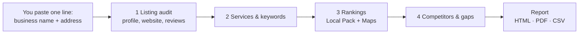

---

## 2. Words used in this document

| Word | Meaning |
|---|---|
| **GBP** | Google Business Profile: the business's listing on Google Search and Maps |
| **place_id** | Google's permanent ID for a listing (e.g. `ChIJ13zKnCeyEmsR…`) |
| **CID** | Another Google ID for a listing, a long number; Local Pack results use it |
| **NAP** | **N**ame, **A**ddress, **P**hone. They should be the same everywhere |
| **Local Pack** | The box with a map and **3 businesses** at the top of normal Google results |
| **Local Finder** | The longer list (about **20 per page**) you get by clicking "More places", or by searching in Google Maps |
| **Visibility score** | 0–100 number showing how visible the business is across its keywords |
| **Keyword** | A search phrase we check, e.g. "plumber in Point Piper" |
| **Competitor** | A business that keeps appearing for the same keywords |
| **Gap** | Something competitors have that the client doesn't, to **review** |
| **Places API** | Google's official service for business information (free monthly allowance) |
| **SerpApi** | A licensed service that returns Google search results (250 free searches/month) |
| **Credit / search** | One SerpApi search = one credit |
| **Job** | A task that runs in the background, e.g. an audit or a ranking check |
| **Worker** | The background program that runs jobs |
| **`.env`** | The settings file on the server (keys, limits). Never shared |
| **Docker** | Packages the app so it runs the same on any server |
| **SSH tunnel** | A safe way to open the server's app in your own browser |

---

## 3. Where we started: the old project

The original repository (`Gautam4424/Google-business-listing`, branch `main`) was a **Flask + Selenium scraper** (`gbp-scraper`, port 5000). It opened Google Maps in a robot browser and copied what it saw.

**What we found when testing it on 11 real listings:**

| Problem | Effect |
|---|---|
| Scraping Google directly | Against Google's terms; breaks whenever Google changes its page; can get the server blocked |
| `review_count` read from the topic chips | Every review count was wrong |
| Database update used the wrong key | Records were duplicated or not updated |
| DuckDuckGo lookup for social links | Added a lot of waiting time (removed on request) |
| No rankings, competitors, gaps or reports | Most of the brief was missing |

**Decision:** rebuild the project properly, step by step, using official data sources. The old scraper was removed (it is still in the `main` branch history).

---

## 4. The goal: the product brief

The target was the **"Local SEO Audit API — Product & Workflow Brief"**. Its main parts, and where each was built:

| Brief section | What it asks for | Built in |
|---|---|---|
| §1 Business discovery | Find and verify the GBP; `place_id`, `match_confidence`, `match_reasons`, manual review if unsure; all profile fields | Phases 2, 3, 4 |
| Step 4 Services | Service list from GBP categories, website and reviews | Phases 2, 5, 6 |
| Step 5 Reviews | Sentiment, topics, monthly summary | Phase 5 |
| §2 Keywords & rankings | Keyword patterns, Local Pack + Local Finder ranks with full search context, visibility score, change over time | Phases 6, 7 |
| §3 Competitors & gaps | Competitor rule (≥ 20% of keywords or ≥ 3 Local Packs), comparisons, gap list with "review eligibility" wording | Phase 8 |
| §4 API & jobs | Endpoints, background jobs, `partial_success`, report | Phases 1, 9 |
| §5 Data model | 15 tables with provenance (source, time, confidence) | Phase 1 (+ extras) |
| §6 Compliance | Official sources, Google's 30-day rule, attribution, no secrets | Phases 1, 9, 10 |
| §7 Phase two | Scheduled audits, geo-grid, citations… | Not in v1 (see section 28) |

---

## 5. Big decisions and why

| Decision | Why |
|---|---|
| **No scraping of Google** | Allowed, stable and safe for the server; required by the brief |
| **Google Places API (New)** for profiles and reviews | Official; generous free allowance (~1,000 lookups per month per type) |
| **SerpApi** for rankings | Licensed Google results with exact location; 250 free searches a month |
| **Free tiers only** | The owner wanted zero spending. Every paid call is counted and capped below the free amount |
| **SerpApi only for rankings** | Credits are scarce, so reviews use Google's free 5 by default. The top 10 via SerpApi is optional (2 credits) |
| **Playwright instead of Selenium** | Faster and lighter, used only as a fallback for websites that need JavaScript. Never used on Google |
| **FastAPI + PostgreSQL + Redis + Celery in Docker** | Standard, reliable, runs on one small server |
| **Ubuntu + Docker only** | The owner's target; Windows/Mac launchers were removed |
| **No login screen (in-house)** | Owner's choice; the app only opens on the server itself |
| **Recommendations say "review whether…"** | Brief rule: never tell a business to copy a competitor's category; only add what is true and eligible |
| **API keys only in `.env`** | Never written to code, docs or commits; masked everywhere on screen |

---

## 6. How the app is built (architecture)

### 6.1 The four containers

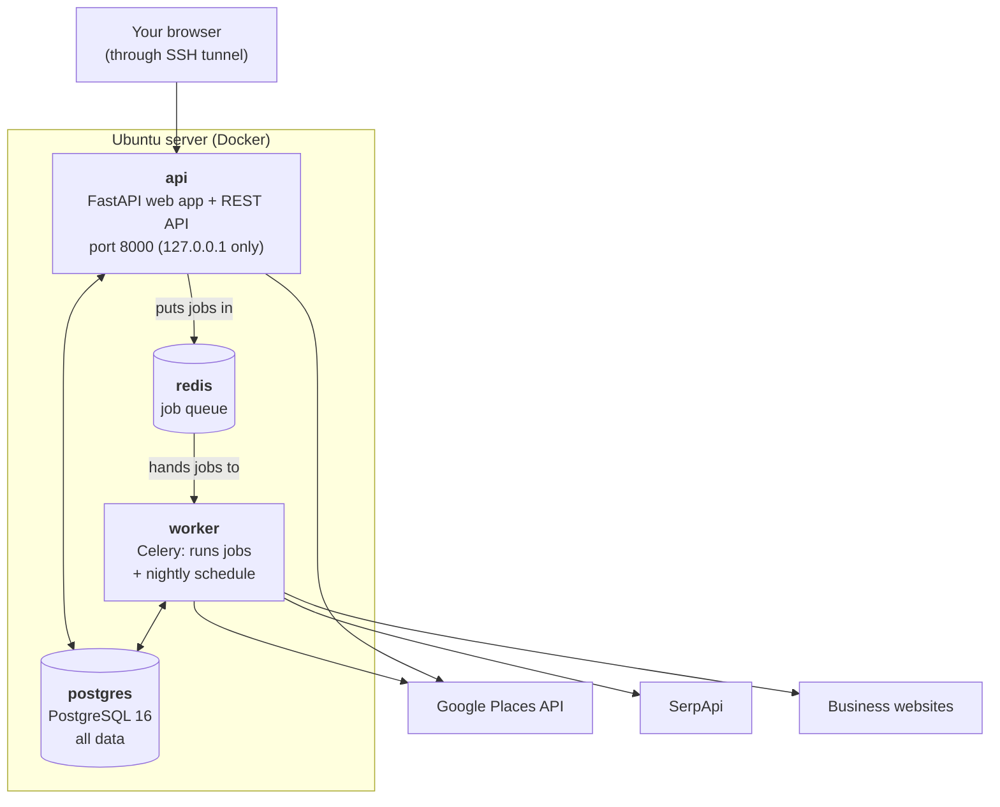

| Container | Job in simple words |
|---|---|
| `api` | Shows the web pages and answers requests. Quick tasks happen here |
| `worker` | Does the slow work in the background: audits, ranking checks, competitor analysis, the nightly clean-up |
| `postgres` | The database: projects, profiles, reviews, keywords, ranks, competitors, gaps, jobs |
| `redis` | A waiting line for jobs between `api` and `worker` |

### 6.2 Inside the code

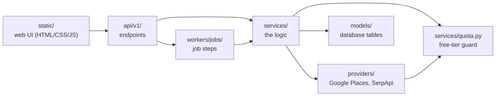

| Folder | Contents |
|---|---|
| `app/api/v1/` | Endpoints: projects, lookup, keywords, rankings, competitors, report, jobs, usage, settings |
| `app/services/` | The logic: website reading, matching, reviews, keywords, rankings, competitors, gaps, report, quota, clean-up |
| `app/providers/` | Talks to Google Places and SerpApi (with one automatic retry) |
| `app/workers/` | Job runner, job definitions, worker schedule |
| `app/models/` | 20 database tables |
| `app/templates/` | The report page design |
| `app/static/` | The web app pages |
| `migrations/` | Database changes (applied automatically at start) |
| `tests/` | 145 automatic tests |
| `docs/` | This document, roadmap, developer guide, API keys guide, product summary |

### 6.3 How a job works

Every slow task is a **job** made of **steps**. Each step is either **required** (if it fails, the job stops) or **optional** (if it fails, the rest continues).

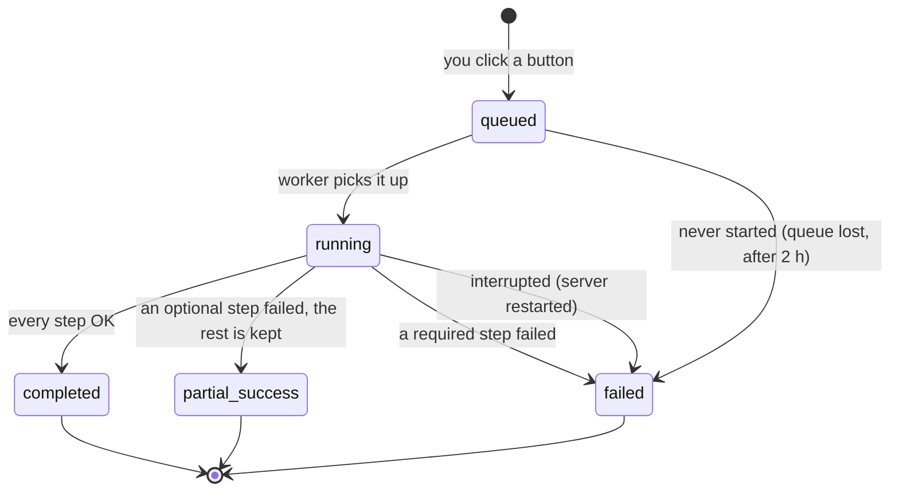

| Job | Started by | Steps |
|---|---|---|
| `diagnostic` | Overview → Run diagnostic | database, Google key, SerpApi key |
| `discover_business` | New project without a listing | read website → find & score candidates (→ starts the audit if sure) |
| `gbp_audit` | Run audit | find place → profile → reviews → website → review analysis → services → keywords → verify match |
| `website_discovery` | Read website only | read the website |
| `review_analysis` | Re-analyse · free | analyse stored reviews |
| `ranking_check` | Run ranking check | credit check → searches → visibility → competitors & gaps |
| `competitor_analysis` | Re-analyse · free | competitors & gaps |
| `full_audit` | Full audit | all of the above in order + report (13 steps) |
| `retention_cleanup` | Every night at 03:00 UTC | 30-day clean-up + stuck-job check |

---

## 7. The phases at a glance

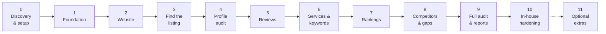

| Phase | Name | Result | Status |
|---|---|---|---|
| 0 | Discovery & setup | Old app analysed, plan written, free API keys working | ✅ |
| 1 | Foundation | Docker, database, jobs, free-tier guard, tests | ✅ |
| 2 | Website extraction | Name/address/phone, social links, services from the website; map-pin distance | ✅ |
| 3 | GBP discovery & matching | Finds the right listing with a confidence score; Quick fill | ✅ |
| 4 | GBP profile audit | Every profile field, correct review count | ✅ |
| 5 | Reviews & NLP | Sentiment, praise/complaints, themes, review summary | ✅ |
| 6 | Services & keywords | One service list; keyword generator with a cap of 10 | ✅ |
| 7 | Rank tracking | Local Pack + Local Finder positions; visibility score; history | ✅ |
| 8 | Competitors & gaps | Competitor rule; comparisons; gap list | ✅ |
| 9 | Full audit & reports | One-click audit; HTML, PDF, CSV report | ✅ |
| 10 | In-house hardening | No double runs, retries, clear limits, clean-up, delete, settings | ✅ |
| 11 | Optional extras | Scheduled audits, geo-grid, citations… | Later |

---

## Phase 0: Discovery and setup

**Goal:** understand the old project, agree on a plan, and get free API access.

**What was done:**
1. Cloned the repository, read `project_documentation.md`, and ran the old app in Docker.
2. Removed the slow DuckDuckGo step (requested).
3. Tested the old scraper on 11 listings and wrote down the bugs (section 3).
4. Compared it with the brief and wrote the plan (`docs/IMPLEMENTATION_PLAN.md`) and roadmap (`docs/ROADMAP.md`).
5. Researched free options: Google Places, Google Business Profile API, SerpApi, DataForSEO (`docs/API_KEYS_AND_FREE_TIERS.md`).
6. Set up the keys: a Google Places API (New) key and a SerpApi key (Free plan, 250/month). Both verified with the diagnostic job.

**Outcome:** a phase plan, free keys in `.env`, and the decision to rebuild.

---

## Phase 1: Foundation

**Goal:** the base every other phase plugs into.

**Built:**
- **Docker setup** with four containers (`api`, `worker`, `postgres`, `redis`), automatic restart, and health checks.
- **Settings** from `.env`, with a template `.env.example`.
- **Database tables** for every part of the brief, with shared "provenance" columns on every record:

  | Column | Meaning |
  |---|---|
  | `source` | Where the data came from |
  | `source_url` | The provider or page |
  | `collected_at` | When it was collected |
  | `last_verified_at` | When it was last checked |
  | `raw_response_id` | Link to the original raw response |
  | `confidence_score` | How sure we are |

- **Job system:** queued → running → completed / partial_success / failed, with a status for each step.
- **Free-tier guard:** every paid call is counted per day and per month and refused before the limit (see section 22).
- **Response cache:** the same request within a set time reuses the saved answer, at no cost.
- **Diagnostic job:** checks the database and both keys.
- **Safety:** API keys are removed from every error message and log.
- **Tests, lint and GitHub CI.**

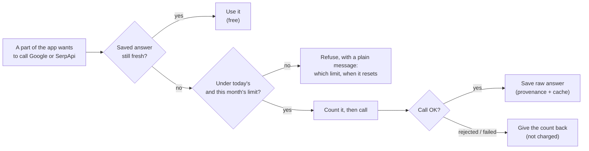

---

## Phase 2: Reading the business's website

**Goal:** use the business's own website as an independent source.

**How the website is read:**

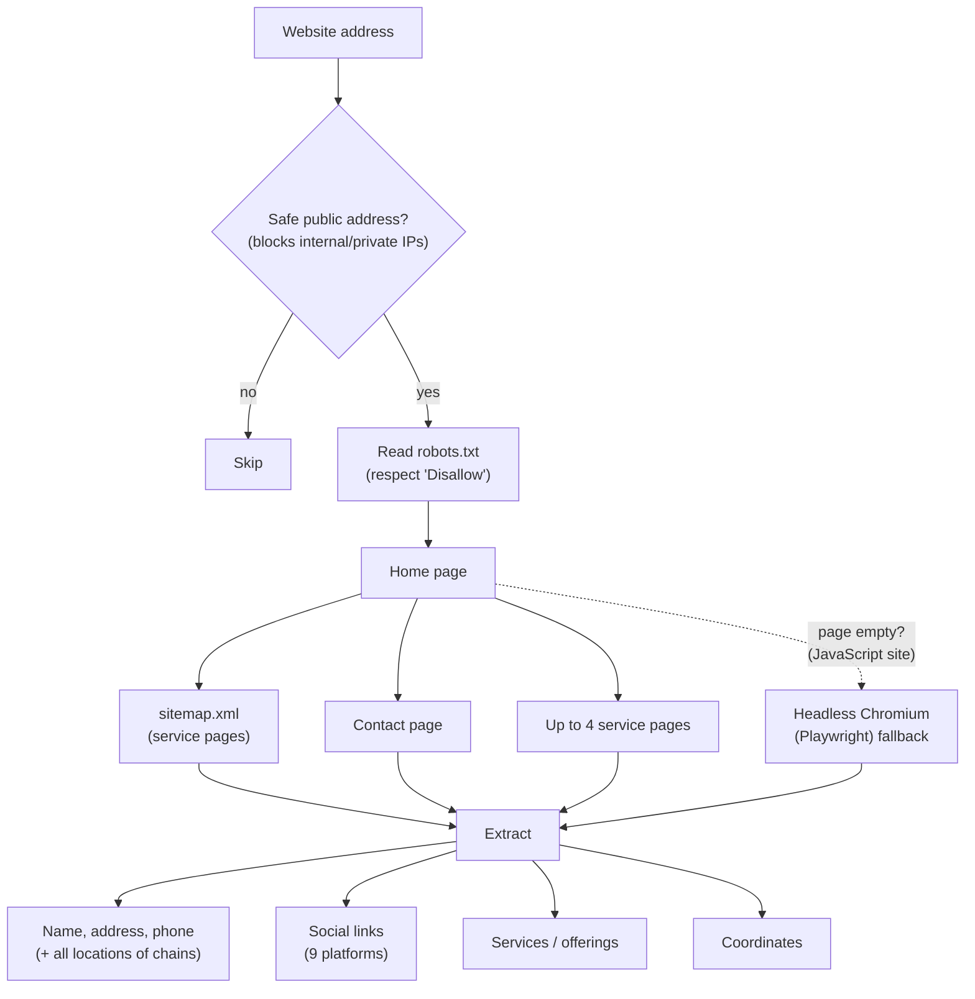

**What it extracts:**

| Item | How |
|---|---|
| Name, address, phone | In this order: structured data on the page (schema.org) → microdata → `tel:` links → `<address>` → postcode lines. Phones checked and written in international format (+61…) |
| Social links | Facebook, Instagram, LinkedIn, X, YouTube, TikTok, Pinterest, Houzz, Yelp. "Share" links are ignored |
| Services | Structured data, menu links, service pages, sitemap, page headings; cleaned of "Learn more", "Explore…" |
| Coordinates | 1) on the website itself, 2) free OpenStreetMap lookup (needs your email in `NOMINATIM_USER_AGENT`), 3) Google Geocoding (if allowed on the key) |
| Chains (several branches) | All addresses and phones are kept, and Google is compared with any of them |

**Website vs Google check:**

| Field | Rule |
|---|---|
| Name | Similarity of at least 85% is a match |
| Phone | Compared in international format; matches if it equals any phone on the site |
| Address | Same postcode + same street (and street number) |
| Map pin | Distance in metres between Google's pin and the website's address. Impossible coordinates (e.g. latitude = longitude) are flagged |

**Example result:** All Australian Plumbing: Google pin 18 m from the website address ✓. Astaneh Construction: postcode on Google `M4N 1S1` but `M4N 3N1` on the website ✗ (a real inconsistency found).

---

## Phase 3: Finding the right Google listing

**Goal:** find the business's listing and its `place_id`, or ask a person when unsure.

**Quick fill:** paste one line such as `Astaneh Construction 3080 Yonge St Ste 6060, Toronto, ON M4N 1S1, Canada`. The app searches Google and fills in every project field (name, address, phone, website, country, area).

**How a candidate is scored (0 to 1):**

| Signal | Weight | Example |
|---|---|---|
| Name | 0.30 | "Proximity Plumbing" vs "Proximity Plumbing Pty Ltd" |
| Address | 0.25 | Same postcode + street + number |
| Phone | 0.20 | Same number |
| Website domain | 0.15 | proximityplumbing.com.au |
| Distance | 0.10 | Pin close to the website's address |

The reference is preferably the **website** (independent evidence), not the user's typing.

- **Missing signals:** if a signal can't be checked, its weight is shared out among the others.
- **Weak evidence is capped:** if little can be checked (less than half the weight), the score is capped at 0.80, so it is never auto-selected on a name alone.
- **Street without a number** counts as weak; a different number scores low.

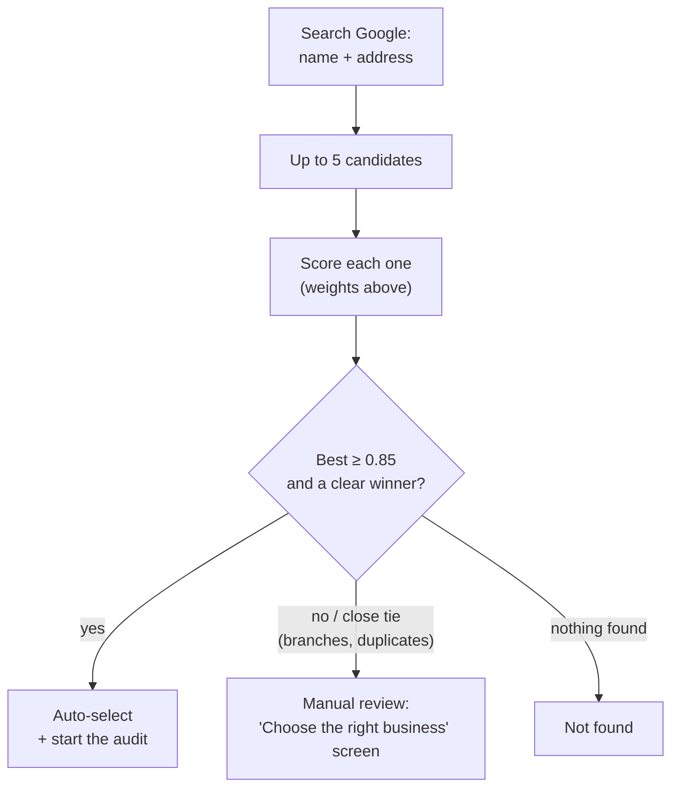

**Results on real projects:**

| Project | Match score |
|---|---|
| All Australian Plumbing | 1.00 |
| OVO Painting | 1.00 |
| Joe's Pizza | 1.00 (after the multi-branch fix) |
| Luxe Home Renovation | 0.875 |
| Astaneh Construction | 0.85 |
| Proximity Plumbing | 0.72 (website postcode differs from Google) |

---

## Phase 4: Google profile audit

**Goal:** every profile field from the brief, correct, and empty ("null") when unknown, never "not offered".

**Fields collected (1 Google lookup per audit):**

| Field | Field | Field |
|---|---|---|
| Business name | Address | Map pin present? |
| Google Maps link | Website (tracking codes removed) | Primary category |
| Other categories | Phone | Opening hours |
| Special/holiday hours | Business status (open / closed) | Service options (delivery, dine-in…) |
| Accessibility | Rating | **Review count** (correct now) |
| Photos returned | Description | Plus code |

Each audit saves a **snapshot**, so changes over time (e.g. review count) can be measured. The step **verify_match** re-scores the listing against the website at the end of every audit.

---

## Phase 5: Reviews and what customers say

**Goal:** reviews with sentiment, topics and a summary, with no paid AI and no credits.

**Where reviews come from:**

| Source | How many | Cost |
|---|---|---|
| Google Places (default) | 5 most relevant | Free (part of the profile lookup) |
| SerpApi (optional "Load top 10" button) | Top 10 + owner replies | 2 SerpApi credits |

**How each review is analysed (on the server, free):**

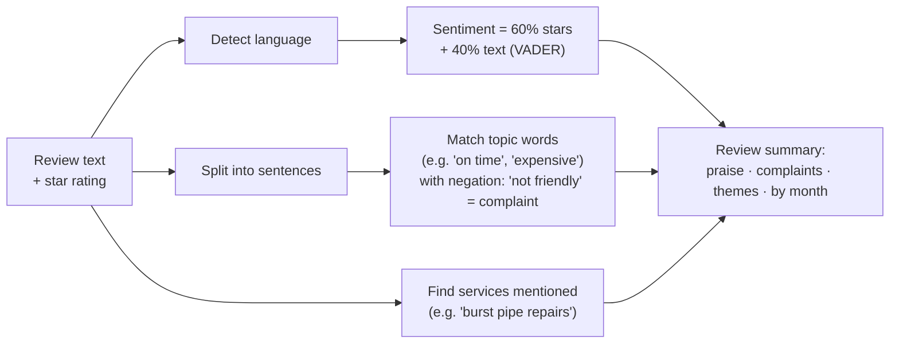

**Themes:** service quality, staff, price/value, speed, cleanliness, communication, specific services.

**Example (Proximity Plumbing):**
- Customers praise: fast service, professional, recommendation, honest/reliable, good value.
- Complaint: expensive (from one 2★ review).

The summary always says "Based on 5 of 2,828 reviews", so a sample is never presented as all reviews.

---

## Phase 6: Services and keywords

**Goal:** one clean service list, and the keywords to track.

**1. One service list.** Services from Google categories, the website and reviews are merged:
- **Place names removed:** "General Plumbing Sydney" becomes "General Plumbing".
- **Duplicates merged:** singular and plural forms count as one service.
- **Each item sorted into a type:**
  - **service** (used for keywords)
  - **customer type** (e.g. "Schools", not used)
  - **generic Google type** (e.g. "Home goods store", hidden)
- **Best five ticked:** each service gets a score, and the top 5 are pre-ticked as **core services**. Your own ticks are never overwritten.

**2. Service areas:** the suburbs or cities served, each with coordinates. An area Google can't find is refused (e.g. a typo).

**3. Keyword patterns** (for each core service × area):

| Pattern | Example |
|---|---|
| in city | plumber in Point Piper |
| near me | plumber near me |
| city | plumber Point Piper |
| yours | any keyword you add |

**4. Keyword cap:** at most **10 keywords are On** (`KEYWORD_CAP`), because each one costs SerpApi searches. Activation order:
1. Your own keywords.
2. "in city" for every core service.
3. "near me".
4. "{service} {city}".

The line above the table shows what one ranking check will cost.

Generating keywords is **free**.

---

## Phase 7: Rankings and visibility score

**Goal:** where the business appears for each keyword that is On, and how that changes.

**Two places are checked per keyword:**

| Place | What it is | How it's checked | Cost |
|---|---|---|---|
| **Local Pack** | Map box with 3 businesses in normal Google results | SerpApi `google` engine, on a mobile phone, searching **from the keyword's coordinates** (works even for small suburbs) | 1 search |
| **Local Finder** | Google Maps list, about 20 businesses | SerpApi `google_maps` engine around the keyword's coordinates | 1 search |

**Two modes:**
- **Full** (default): both checks, 2 searches per keyword.
- **Maps only:** 1 search per keyword. The Local Pack is estimated from the Maps top 3 and marked "est.".

**Visibility score:**

| Where | Rank 1 | Rank 2 | Rank 3 | 4–10 | 11–20 | Not found |
|---|---|---|---|---|---|---|
| Local Pack | 100 | 70 | 50 | — | — | 0 |
| Local Finder | 40 | 40 | 40 | 20 | 10 | 0 |

Each keyword can earn up to **140** points. Score = total points ÷ (140 × number of keywords) × 100.

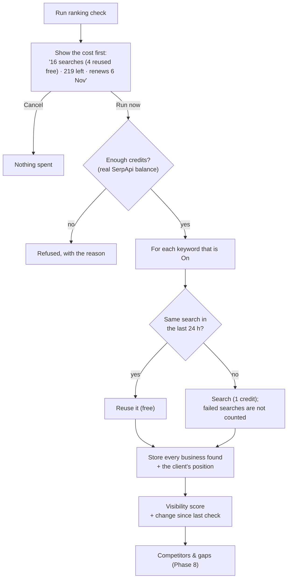

**What is stored for each search:**
- **The search itself:** time, keyword, country, language, device, location, coordinates, search radius, whether a Local Pack was shown, and whether the result was reused.
- **Every business found:** rank, IDs, name, address, category, rating, reviews, phone, website and coordinates.

**Change over time** is compared only over the keywords checked both times, so adding a keyword never creates a fake jump.

**Search from (you choose, in the "Run ranking check" box):**

| Choice | Google is told the searcher is… | Example (OVO Painting, Atlanta) | Map search |
|---|---|---|---|
| **City centre** (default) | at the centre of the keyword's city/suburb (Google's own point for that place) | downtown Atlanta (33.7501, −84.3885) | Google Maps around that point |
| **City (Google's area)** | in the city as a whole, like Google's **"Choose area"** setting (what signed-in users who picked a city see) | Atlanta, Georgia, United States | Google's Local Finder list ("More places") for the city |
| **Whole country** | somewhere in the country (no exact point) | United States | Google's Local Finder list (“More places”) for the country |
| **Business location** | at the business's own map pin | OVO's office (33.8933, −84.3819) | Google Maps around the pin |
| **My current location** | where **you** are now (your browser shares it after asking once) | e.g. Ghaziabad (28.6692, 77.4538) | Google Maps around you |

"My current location":
- **Use it to compare** the app with what you see in your own Google search.
- **Not saved as the project default.** The full audit uses one of the other three.
- **The country setting stays the business's** (e.g. US).
- **The browser only shares location with `http://localhost` (the SSH tunnel) or `https://` addresses.** If you blocked it: padlock in the address bar → Location → Allow.

- **Your choice is remembered** for the project, and the full audit uses it too.
- **Results are labelled:** every result shows "📍 searched from …".
- **Change is like for like:** "change since last check" only compares checks made from the **same** place.
- **Why it matters:** searching from the business's own address flatters it, because Google favours nearby businesses. **City centre** shows what a typical customer in that city sees.

**See every business, not just your position:** click **Top 20 ▸** next to a keyword in the Rankings table.
- **The full lists open underneath:** the **Local Pack** (3) and the **Local Finder** (up to **20**), with category, rating, reviews and a Maps link.
- **Your client is outlined**, and the 20-result list scrolls in its own panel.
- **Same data in the CSV download:** `results.csv` (Report → Download CSV) has every business for every keyword.
- **No extra cost:** each search already returns the top 20, so this uses no extra credits.
- **Check any result yourself:** above the lists, for the Local Pack and the Local Finder, the full addresses are shown in boxes with a **Copy** button.
  - **Proof on Google** is the same search as a plain Google address, with the place built in. That's a point, or for **City (Google's area)** and **Whole country** a named place, which Google shows as e.g. "Noida, Uttar Pradesh · Choose area". For the Local Finder it's the Google Maps list (point searches) or Google's "More places" list (named places). Paste it into an **incognito window**; the Local Pack was checked as a phone, so use phone view (F12 → Ctrl+Shift+M).
  - **SerpApi's copy** is the page **exactly as SerpApi received it**. It opens without a SerpApi login, so treat it as shareable.
  - **In the CSV:** `results.csv` has the proof address for every row.

**Live results and limits:**
- **Results appear as they arrive.** The check runs **keyword by keyword, Local Pack first**, and each result appears straight away in the Rankings section's **Live check** table (with a progress bar).
- **A limit part-way keeps what was found.** If a free-tier limit is reached during the check (e.g. on keyword 2), it **stops** there: keyword 1's results are kept, a Maps search that didn't run shows "not checked (limit)", and the card explains "Limit reached after 1 of 2 keywords…".
- **Fewer credits than needed:** the check still starts, and goes as far as the limit allows.
- **Limit already reached:** the Rankings card shows one plain red message with the reset time, and the button says **Limit reached**. There's no spinner and no repeated checking.

**Live example (Proximity Plumbing):**

| Keyword | Local Pack | Local Finder | Score |
|---|---|---|---|
| plumber in Point Piper | #1 | #1 | 100 |
| blocked drains near me | #1 | #17 | 78.6 |
| **Visibility** | | | **89.3 / 100** |

Problems found and fixed during the live test:
- **Small suburbs:** these were missing from Google's location list, so the check now searches from coordinates instead.
- **Timeouts:** 20 s was too short, so it's now 120 s.
- **Change over time:** it is now compared like-for-like, over the same keywords.

---

## Phase 8: Competitors and gaps

**Goal:** the real competitors, and what to review. It uses **no SerpApi credits** because it works from the stored ranking results.

**The competitor rule (from the brief).** A business counts as a competitor if, in the latest ranking check, it either:
- appears for **at least 20% of the keywords**, or
- appears in the **Local Pack for at least 3 keywords**.

The client is excluded, and the 10 most visible are kept (`COMPETITOR_MAX`).

**What is compared:**

| Item | Source |
|---|---|
| Google categories (all of them) | Maps search results |
| Rating, review count, website | Search results + 1 Google lookup per competitor (cached 7 days) |
| Review speed (new reviews per 30 days) | Two snapshots at least 7 days apart |
| What customers praise | Google's sample of 5 reviews. Only the topics are kept, never the texts |
| Keyword overlap, Local Pack / Maps appearances | Ranking results |

**The gaps:**

| Gap type | Rule | Example wording |
|---|---|---|
| **Category** | Used by ≥ 50% of competitors (at least 2), not by the client; generic Google labels ignored | "Review whether 'Gasfitter' is an accurate and eligible additional category for Proximity Plumbing. The business lists Gas Plumbing, Gas Leak Detection, which may support it." |
| **Service** | Found for ≥ 2 competitors (category or reviews), missing from the client's services; comes with a suggested keyword | "Review whether Luxe offers 'Bathroom renovation'. If it does, describe it on the website…" |
| **Reviews** | Client's review count, rating or review speed below the competitors' middle value | "Competitors have a median of 74 Google reviews; Luxe has 48…" |
| **Review topic** | Praised for ≥ 30% of competitors (at least 2), but missing from (or a complaint in) the client's reviews | "Customers praise 5 competitors for 'on time'…" |
| **Ranking** | Competitors in the Local Pack where the client is not | "3 competitors appear in the Local Pack for 'general contractor in Toronto' but Luxe does not" |

**Priority:**
- **High:** category gaps backed by the client's own services, ranking gaps where the client is outside the top 10, and topics that are complaints in the client's reviews.
- **Medium / low:** everything else.

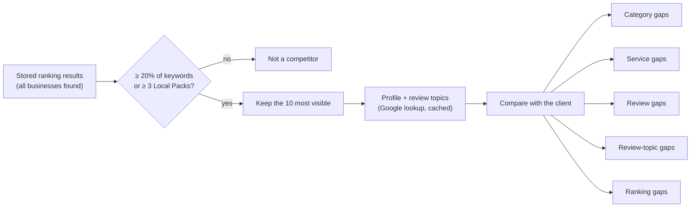

**Protecting the Google allowance:** competitor lookups stop while **10** Google lookups are still left, so client audits can always run (`COMPETITOR_DETAILS_RESERVE`).

---

## Phase 9: One-click full audit and reports

**Goal:** run everything with one click and produce a report.

**Full audit (13 steps):**

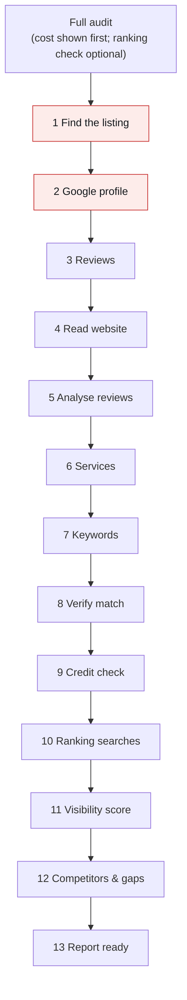

Steps 1–2 (red) are **required**: if they fail, the audit stops. Steps 3–13 are **optional**: if one fails, the rest is kept and the job ends as `partial_success`.

**Safety rules:**
- **Credit check first:** SerpApi searches only run if the credit check passed in the same job.
- **Ranking check optional:** with it unticked, the audit uses **0 SerpApi** credits, and competitors and gaps reuse the last check.

**The report** (built from saved data, so no cost):

| Format | What you get |
|---|---|
| **HTML** | A printable page (opens in a new tab) |
| **PDF** | The same page as A4, printed by the browser built into the app (about 2 seconds) |
| **CSV** | A zip with 7 spreadsheets: profile, website check, reviews, keywords, rankings, competitors, gaps (open in Excel) |

**Report sections:**
1. Summary tiles: match %, rating, reviews, visibility score, competitors, gaps.
2. **Top priorities.**
3. Google profile, plus "Is this the right listing?".
4. Website vs Google, plus social profiles.
5. Reviews: praise, complaints, each review with its author and a "View on Google" link.
6. Services & keywords.
7. Local rankings, with the scoring explained.
8. Competitors table (you vs them).
9. Gaps to review.
10. **Sources:** where each piece of data came from and when (required by Google's attribution rules).

---

## Phase 10: In-house hardening

**Goal:** safe and dependable for in-house use. The scope was agreed with the owner:
- **No login screen.**
- **No automatic database backups** (the manual commands are in the README).
- **Server-only access**, unchanged.

| # | Feature | In simple words |
|---|---|---|
| 1 | Access | Unchanged: the app only opens on the server (SSH tunnel) |
| 2 | **No double runs** | One job per project at a time. A second click gets "already running… wait". SerpApi capped at 40 searches/day |
| 3 | **One automatic retry** | A brief Google/SerpApi glitch (timeout, overload) is retried once; rejected keys never are; failed calls are free |
| 4 | **Clear limit messages** | E.g. "SerpApi searches: daily limit reached (40/40). Resets at 00:00 UTC, in 5 h 12 min. To allow more per day, raise QUOTA_SERPAPI_DAILY in .env." Shown as a yellow banner |
| 5 | **Interrupted jobs** | After a restart, a half-done job says "Interrupted… please run it again". A stuck job stops blocking its project after 2 hours |
| 7 | **Small logs, `DEBUG=false`** | Logs capped at 30 MB per container; keys never logged |
| 8 | **Nightly 30-day clean-up** | Google's rule (details in section 26) |
| 9 | **Delete project** | 🗑 button with a red confirmation box |
| 10 | **Settings page** | Masked keys, all limits and usage, reset times, worker status, last clean-up. **Settings can be changed here** (see section 23) |
| 11 | **End-to-end tests** | Whole flow tested automatically; tests can't reach real APIs |
| 12 | **Documentation** | README, `docs/PRODUCT.md`, this document |

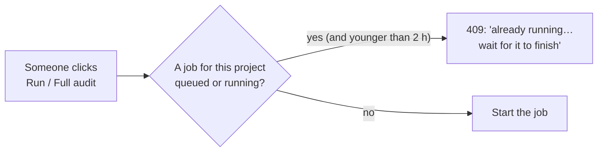

---

## 19. The web app, screen by screen

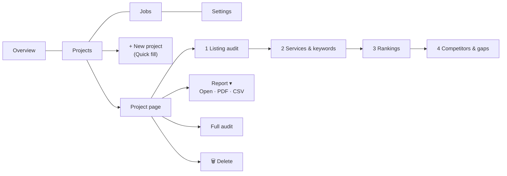

| Screen | What you see and do |
|---|---|
| **Overview** | System status, number of projects and jobs, free-tier usage meters, setup check (Run diagnostic), recent jobs, limit banner |
| **Projects** | A card per project with its match %. **+ New project** with Quick fill |
| **Project page** | Header: Report ▾, Read website only, Run audit, **Full audit**, 🗑. Step buttons 1–4 at the top jump to each section |
| ↳ 1 Listing audit | Audit progress, "Choose the right business" (if unsure), listing match, Google profile, opening hours, social profiles, offerings, Website vs Google, reviews with insights ("Load top 10 · 2 credits", "Re-analyse · free") |
| ↳ 2 Services & keywords | Tick core services, add/remove areas, keyword table with On/Off switches, your own keywords, "Next: check rankings ↓" |
| ↳ 3 Rankings | Visibility score, change, counts, history bars, keyword table (▲▼, new, est.), businesses appearing most, **Run ranking check** with the cost confirmation |
| ↳ 4 Competitors & gaps | You vs competitors table, gaps with priority and evidence, "Track keyword" buttons, Re-analyse · free |
| **Jobs** | Every job with status filter; job page with each step's result and errors |
| **Settings** | Read-only status (see Phase 10) |

The UI works on phones, has light and dark modes, and keeps your scroll position when you tick keywords.

---

## 20. Data: what is stored and where

All data is in PostgreSQL (Docker volume `local-seo-audit_pgdata`). The 20 tables:

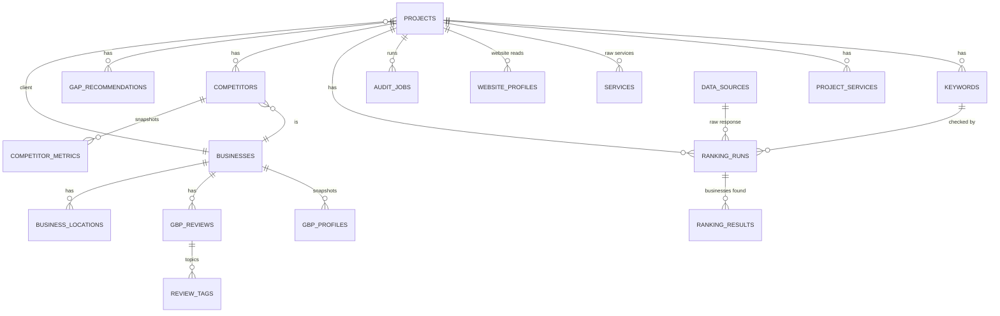

| Table | Holds |
|---|---|
| `projects` | Each audit project: input name, address, website, country, areas, match result |
| `businesses` | Every business seen (client, candidates, competitors), by `place_id` / CID |
| `gbp_profiles` | Google profile snapshots |
| `business_locations` | Google pin, website coordinates, pin distance |
| `gbp_reviews` / `review_tags` | Reviews, sentiment, topics |
| `website_profiles` | Each website read: NAP, pages read, notes |
| `services` / `project_services` | Raw services from each source / the clean merged list |
| `keywords` | Keywords with area, coordinates, language, country, device, On/Off |
| `ranking_runs` / `ranking_results` | Each search with its context / every business found |
| `competitors` / `competitor_metrics` | Competitors / their snapshots |
| `gap_recommendations` | The gap list |
| `audit_jobs` | Every job with its steps |
| `app_settings` / `setting_changes` | Settings changed in the app (override `.env`) / their history (keys masked) |
| `data_sources` | Raw provider answers (proof + cache), with an expiry date |
| `api_usage` | Paid calls counted per day |

---

## 21. API endpoints (for developers)

Everything in the web app is also available as a REST API (interactive docs at `http://localhost:8000/docs`).

| Area | Endpoints |
|---|---|
| System | `GET /health` · `GET /v1/usage` · `GET /v1/settings` |
| Projects | `POST /v1/projects` · `GET /v1/projects` · `GET/DELETE /v1/projects/{id}` · `GET …/profile` |
| Quick fill | `POST /v1/lookup/business` |
| Find the listing | `POST/GET /v1/projects/{id}/discover-business` · `POST …/discover-business/select` |
| Audit | `POST …/gbp-audit` · `POST …/website-discovery` · `POST …/full-audit` |
| Reviews | `GET …/reviews` · `POST …/reviews/analyze` |
| Services & keywords | `GET/POST …/services` · `POST …/services/refresh` · `PATCH …/services/{sid}` · `PUT …/service-areas` · `POST …/keywords/generate` · `GET/POST …/keywords` · `PATCH/DELETE …/keywords/{kid}` |
| Rankings | `GET …/rankings/estimate` · `POST …/rankings/run` · `GET …/rankings` |
| Competitors & gaps | `GET …/competitors` · `POST …/competitors/analyze` · `GET …/gaps` |
| Report | `GET …/report?format=html\|pdf\|csv\|json` (`&section=` for one CSV) |
| Jobs | `POST /v1/jobs` · `GET /v1/jobs` · `GET /v1/jobs/{id}` |

Answers to note:
- **`202`:** the job has started.
- **`409`:** a job is already running for that project.
- **`422`:** something is missing or there aren't enough credits; the message says what.
- **`503`:** the job queue or the PDF browser is unavailable.

---

## 22. Costs, free limits and credit protection

**Cost so far: 0.** Everything stays inside the free tiers.

| Service | Free allowance | App limit (`.env`) | Used for |
|---|---|---|---|
| Google Places · profile lookups | ~1,000/month | **900/month, 100/day** | 1 per audit; up to 1 per competitor (cached 7 days) |
| Google Places · business search (Quick fill) | ~1,000/month | 900/month, 30/day | 1 per new project (cached 7 days) |
| Google Places · business search (basic) | larger | 4,500/month, 150/day | areas, matching |
| Google Geocoding | ~10,000/month | 9,000/month | only websites without coordinates |
| SerpApi | **250/month**, renews on your sign-up day (the 6th) | **240/month, 40/day** | ranking checks; optional top-10 reviews |
| Website reading, review analysis, competitors, reports | unlimited | — | runs on your server |

**What a ranking check costs:**

| Keywords On | Full mode | Maps only |
|---|---|---|
| 5 | 10 searches | 5 |
| 10 | 20 searches | 10 |
| Same keywords again within 24 h | free | free |

With 240 searches a month, that is about **12 full checks of 10 keywords**, or 24 in Maps-only mode.

**Every protection in one place:**

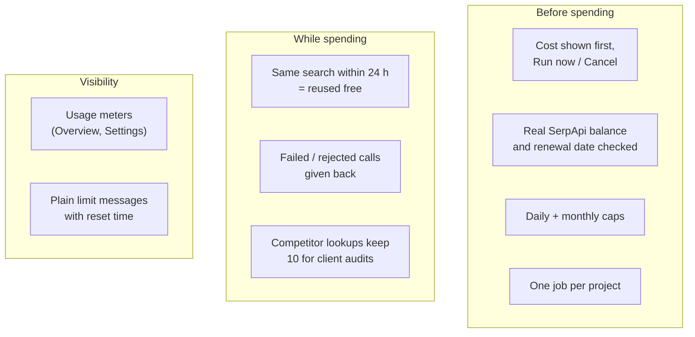

---

## 23. All settings (`.env`)

There are two ways to change a setting.

**1. In the app (easiest):** open **Settings → Change settings**, edit a value, and click **Save**.

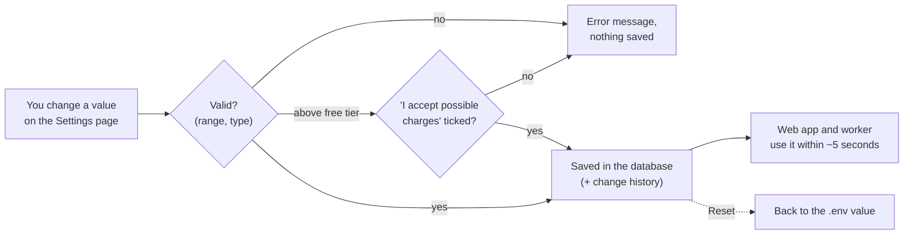

- **What can be changed:** API keys, free-tier limits, ranking mode, keyword cap, free re-check window, Maps area, top-10 reviews, competitor options, website browser, OpenStreetMap contact, retries, stuck-job time, clean-up days and hour, and `DEBUG`.
- **When it applies:** no restart is needed, except for `DEBUG` and `CLEANUP_HOUR_UTC` (`docker compose restart api worker`).
- **Keys are write-only:** they're never shown again, only masked (e.g. `AIza…Y4`).
- **Above the free tier:** a monthly limit above it needs the "I accept possible charges" tick.
- **`.env` stays the default:** a value changed in the app shows "changed in app", and **Reset** goes back to `.env`.

**2. In `.env` on the server:** needed for the database, ports and passwords. Edit the file, then run `docker compose up -d`.

| Setting | Default | Meaning |
|---|---|---|
| `GOOGLE_API_KEY` | — | Google Places API (New) key (**required**) |
| `SERPAPI_KEY` | — | SerpApi key (needed for rankings) |
| `POSTGRES_PASSWORD` | — | Database password (generated at install) |
| `APP_BIND` / `APP_PORT` | `127.0.0.1` / `8000` | Where the app listens. Keep `127.0.0.1` (no login) |
| `DEBUG` | `false` | `true` = detailed logs for troubleshooting |
| `QUOTA_PLACES_DETAILS_MONTHLY` / `_DAILY` | 900 / 100 | Google profile lookups |
| `QUOTA_PLACES_TEXTSEARCH_ENTERPRISE_MONTHLY` / `_DAILY` | 900 / 30 | Quick fill / find business |
| `QUOTA_PLACES_TEXTSEARCH_MONTHLY` / `_DAILY` | 4,500 / 150 | Basic business search |
| `QUOTA_GEOCODING_MONTHLY` / `_DAILY` | 9,000 / 0 (no daily cap) | Address lookups |
| `QUOTA_SERPAPI_MONTHLY` / `_DAILY` | 240 / 40 | SerpApi searches |
| `SERPAPI_REVIEWS_ENABLED` | `false` | `true` = top 10 reviews on every audit (2 credits each) |
| `KEYWORD_CAP` | 10 | Max keywords switched On per project |
| `RANKING_MODE` | `full` | `full` (2/keyword) or `maps_only` (1/keyword) |
| `RANKING_CACHE_HOURS` | 24 | Re-check within this time = free |
| `MAPS_ZOOM` | 14 | Size of the Maps search area around a keyword |
| `COMPETITOR_MAX` | 10 | Competitors analysed per project |
| `COMPETITOR_DETAILS` | `true` | 1 Google lookup per competitor for review topics |
| `COMPETITOR_DETAILS_RESERVE` | 10 | Lookups kept for client audits |
| `GOOGLE_DATA_TTL_DAYS` | 30 | Google content kept this many days |
| `CLEANUP_HOUR_UTC` | 3 | When the nightly clean-up runs |
| `PROVIDER_RETRIES` | 1 | Retries for temporary Google/SerpApi errors |
| `JOB_STALE_MINUTES` | 120 | When a stuck job is released |
| `NOMINATIM_USER_AGENT` | — | Your email, for free OpenStreetMap address lookups |
| `BROWSER_FALLBACK` | `true` | Use headless Chromium for JavaScript-only websites |

---

## 24. Installing and running on Ubuntu

Full step-by-step instructions are in the [README](../README.md). In short:

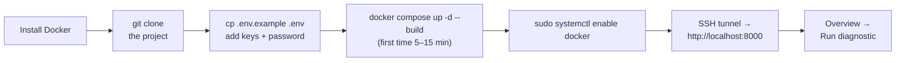

```bash
# open the app from your computer (keep this window open)
ssh -L 8000:127.0.0.1:8000 youruser@YOUR_SERVER_IP
# then browse to http://localhost:8000
```

| Task | Command (in the app folder) |
|---|---|
| Status | `docker compose ps` |
| Live logs | `docker compose logs -f api worker` |
| Apply `.env` changes | `docker compose up -d` |
| Update the app | `git pull && docker compose up -d --build` |
| Stop (data kept) | `docker compose down` |
| Manual backup | `docker compose exec -T postgres pg_dump -U seo -d seo \| gzip > backup-$(date +%F).sql.gz` |

**Requirements:**
- **Minimum:** Ubuntu 22.04 or 24.04 (64-bit), 2 vCPU, 4 GB RAM, 10 GB free disk.
- **Recommended:** 8 GB RAM and 20 GB disk.
- **You also need:** outbound internet access and a user with `sudo`.

---

## 25. Testing and quality

| Item | Detail |
|---|---|
| Automatic tests | **145**, run in the app's Docker image; every Google/SerpApi/website call is simulated; real network calls are blocked |
| Main areas tested | Free-tier guard, website reading, matching, profile fields, review analysis, keywords, rankings and scoring, competitors and gaps, full audit, report formats, no double runs, retries, limit messages, delete, settings, clean-up, end-to-end flow |
| Lint / format | `ruff` (clean) |
| CI | GitHub Actions runs tests and lint on each push |
| Live checks | Each phase was tested on real businesses (Proximity Plumbing, All Australian Plumbing, OVO Painting, Joe's Pizza, Luxe Home Renovation, Astaneh Construction) and checked in a real browser |

```bash
docker compose run --rm --no-deps -v "$PWD:/src" -w /src api sh -c "pip install -r requirements-dev.txt && pytest"
```

---

## 26. Security and Google's rules

| Rule | How the app follows it |
|---|---|
| No scraping of Google | Only the Places API and SerpApi; Chromium is used only on the business's own website |
| Respect websites | Reads `robots.txt`, a few pages only, and refuses private/internal addresses |
| **Google 30-day rule** | Nightly clean-up at 03:00 UTC. **Removed** after 30 days: raw responses, review texts, author names and owner replies, and older profile snapshots. **Kept:** place IDs, scores, ranks, history, topics and gaps. The latest profile stays until the next audit refreshes it |
| Attribution | Review authors and "View on Google" links shown; report lists its sources |
| Honest recommendations | Gaps say "review whether … is accurate and eligible", never "add" |
| Keys stay secret | Only in `.env` (git-ignored, `chmod 600`); removed from errors and logs; masked on screen (`AIza…Y4`) |
| No login → server only | App listens on `127.0.0.1`; opened through an SSH tunnel |
| Logs | Capped size; `DEBUG=false`; request URLs with keys never logged |

**Checklist:**
- [ ] `.env` is `chmod 600`.
- [ ] `APP_BIND=127.0.0.1` and `DEBUG=false`.
- [ ] Google key restricted to the Places API (+ Geocoding) and the server IP.
- [ ] A $1 billing alert is set in Google Cloud.
- [ ] `ufw` allows OpenSSH only.
- [ ] `sudo systemctl enable docker` has been run.

---

## 27. Troubleshooting

| You see | What to do |
|---|---|
| "already running … wait for it to finish" | Another job for that project is running; wait, or check **Jobs** |
| "daily limit reached … Resets at 00:00 UTC" | Wait for the reset, or raise the named `QUOTA_..._DAILY` in `.env` (keep the monthly ones) |
| "Not enough SerpApi searches" | Switch some keywords Off, use Maps only, or wait for the renewal date |
| Job says "Interrupted" | The server restarted during it; run it again |
| "Manual review required" | Open the project and pick the right business in "Choose the right business" |
| "Map pin vs site: Not available" | Set `NOMINATIM_USER_AGENT` with your email, or enable the Geocoding API on your key |
| Settings: worker "not responding" | `docker compose up -d`; check `docker compose logs --tail=100 worker` |
| Diagnostic: Google key red | Places API (New) not enabled, wrong key restrictions, or billing not linked |
| Diagnostic: SerpApi red | Key incomplete (about 64 characters) or account not verified |
| Anything else | `docker compose logs --tail=200 api worker` (set `DEBUG=true` for more detail, then back) |

---

## 28. What is not included, and ideas for later

**Not included by choice:**
- **Login screen:** the app is in-house and server-only.
- **Automatic database backups:** declined; the manual commands are in the README.
- **Reading competitors' websites:** their categories and reviews are used instead, which is faster.

**Needs something extra:**
- **Owner-only Google data** (all reviews, posts, insights) needs Google's Business Profile API approval, and only works for listings you manage.

**Phase 11 ideas** (pick any, one at a time):

| Idea | Note |
|---|---|
| Scheduled weekly/monthly audits | Uses credits every run |
| Geo-grid rankings (5×5 or 7×7 points around the city) | 25–49 searches per keyword: too heavy for the free plan |
| Citation check (same NAP on directories) | Free-ish, needs directory sources |
| AI-written recommendations from the gaps | Would still use "review eligibility" wording |
| Review-reply and post monitoring | Needs the Business Profile API |
| Backlink analysis | Needs a paid data provider |

---

## 29. History: what was done, in order

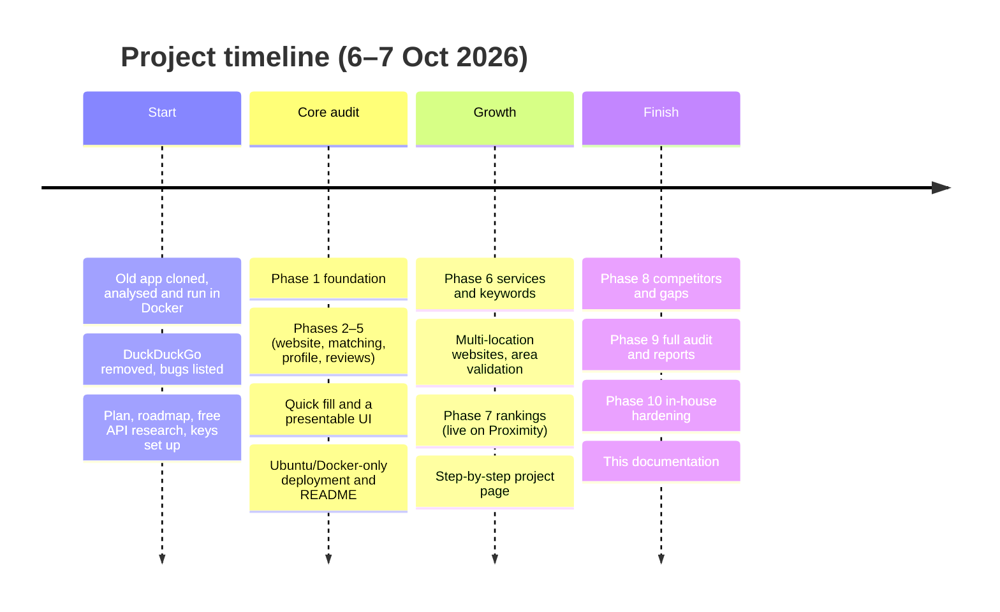

**Commits on `feature/local-seo-audit-v1`:**

| Commit | What |
|---|---|
| `e4faf69` | Phases 1–5: foundation, website, GBP matching, audit, reviews |
| `c8691dd` | Old scraper removed, plain-language README |
| `dba5198` | Docker-on-Ubuntu only deployment |
| `258e736` | Phase 6: services, areas, keyword generator |
| `4b39531` | Multi-location websites; unknown service areas refused |
| `52ed806` | Phase 7: Local Pack + Local Finder rankings, visibility score |
| `d4e83ae` | Project page in step order; keyword toggle no longer jumps |
| `e7c38d9` | Roadmap updates |
| `4f781df` | Phase 8: competitors and gaps |
| `bf2853b` | Phase 9: full audit and reports |
| `561010e` | Phase 10: in-house hardening |

**Other documents:**
- [README](../README.md): install and run on Ubuntu.
- [PRODUCT.md](PRODUCT.md): a short product summary.
- [SERPAPI_TEST_CASES.md](SERPAPI_TEST_CASES.md): 13 hand tests (with exact links) to check that the Local Pack / Local Finder data matches Google.
- [ROADMAP.md](ROADMAP.md): phase checklist and verification notes.
- [DEVELOPERS.md](DEVELOPERS.md): developer guide.
- [IMPLEMENTATION_PLAN.md](IMPLEMENTATION_PLAN.md): the original technical plan.
- [API_KEYS_AND_FREE_TIERS.md](API_KEYS_AND_FREE_TIERS.md): how to get the keys.
